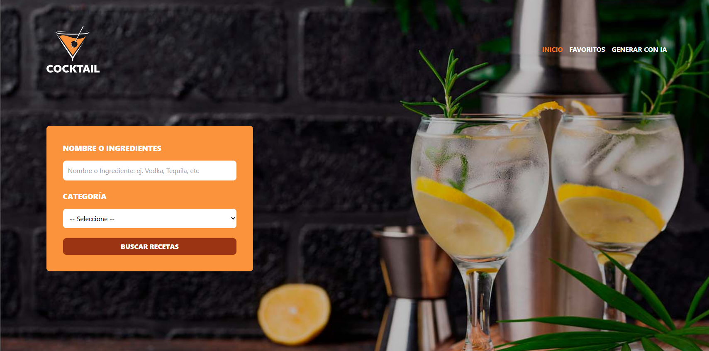

# 🍹 Buscador de Bebidas con IA

Aplicación web para encontrar recetas de bebidas y cócteles. Puedes buscar por ingrediente y categoría usando la API pública de [TheCocktailDB](https://www.thecocktaildb.com/), ver los ingredientes e instrucciones de cada receta, guardar tus favoritas y, si no encuentras lo que buscas, **generar recetas nuevas con inteligencia artificial**.

Está construida con **Vue 3**, **Pinia**, **Vue Router** y **Tailwind CSS**. La generación con IA se hace a través de [OpenRouter](https://openrouter.ai/) usando el [AI SDK](https://sdk.vercel.ai/).



## ✨ Características

- **Búsqueda de recetas** por nombre o ingrediente y categoría, con las categorías cargadas directamente desde la API.
- **Detalle de cada receta** en un modal con imagen, lista de ingredientes con sus cantidades e instrucciones de preparación.
- **Favoritos**: agrega o elimina recetas de tu lista desde el modal y consúltalas en su propia sección.
- **Generación de recetas con IA**: describe la bebida que quieres (por ejemplo, *"bebida con tequila y fresa"*) y la respuesta aparece en tiempo real mientras se genera.
- **Notificaciones** de éxito y error, por ejemplo al agregar favoritos o al dejar campos vacíos.
- **Persistencia con LocalStorage** para los favoritos.
- **Diseño responsivo** con Tailwind CSS.

## 🛠️ Tecnologías

- [Vue 3](https://vuejs.org/) con Composition API y `<script setup>`
- [Pinia](https://pinia.vuejs.org/) para el manejo del estado
- [Vue Router](https://router.vuejs.org/) para la navegación entre vistas
- [Vite](https://vitejs.dev/) como herramienta de desarrollo y build
- [Tailwind CSS](https://tailwindcss.com/), [Headless UI](https://headlessui.com/) y [Heroicons](https://heroicons.com/)
- [Axios](https://axios-http.com/) para las peticiones a TheCocktailDB
- [AI SDK](https://sdk.vercel.ai/) con el proveedor de [OpenRouter](https://openrouter.ai/) para la generación con IA

## 📋 Requisitos

- [Node.js](https://nodejs.org/) 18 o superior
- npm (incluido con Node.js)
- Una API key de [OpenRouter](https://openrouter.ai/keys) (solo para la sección de IA)

## 🚀 Instalación y uso

1. Clona el repositorio:

   ```bash
   git clone https://github.com/SuemyDzib/bebidas-vue-ia.git
   cd bebidas-vue-ia
   ```

2. Instala las dependencias:

   ```bash
   npm install
   ```

3. Crea un archivo `.env` en la raíz del proyecto a partir del ejemplo y coloca tu API key de OpenRouter:

   ```bash
   cp .env.example .env
   ```

   ```env
   VITE_OPENROUTER_KEY=tu_api_key_aqui
   ```

4. Inicia el servidor de desarrollo:

   ```bash
   npm run dev
   ```

5. Abre en tu navegador la URL que muestra la terminal (por defecto `http://localhost:5173`).

> La búsqueda de recetas y los favoritos funcionan sin API key; solo la sección **Generar con IA** la necesita.

### Otros scripts

| Comando           | Descripción                                              |
| ----------------- | -------------------------------------------------------- |
| `npm run dev`     | Inicia el servidor de desarrollo con recarga en caliente |
| `npm run build`   | Genera la versión de producción en la carpeta `dist/`    |
| `npm run preview` | Sirve localmente la versión de producción generada       |

## 📖 Cómo se usa

**Buscar recetas.** En la página de inicio escribe un nombre o ingrediente, elige una categoría y presiona **Buscar Recetas**. Haz clic en **Ver Receta** para abrir el detalle.

**Favoritos.** Dentro del modal de una receta presiona **Agregar a Favoritos**. Puedes verlas todas en la sección **Favoritos** y quitarlas desde el mismo modal.

**Generar con IA.** Ve a **Generar con IA**, describe la bebida que te gustaría y envía. La receta se irá mostrando conforme la IA la escribe.

## ⚠️ Nota sobre la API key

Como esta es una aplicación que corre completamente en el navegador, cualquier variable con prefijo `VITE_` se incluye en el código que se envía al usuario. Esto significa que la API key de OpenRouter es visible para quien inspeccione la app. Para uso personal o de aprendizaje está bien, pero si vas a publicarla, conviene mover la llamada a la IA a un backend o a una función serverless, o al menos establecer un límite de gasto en tu cuenta de OpenRouter.

## 🙌 Créditos

- Recetas e imágenes de [TheCocktailDB](https://www.thecocktaildb.com/).